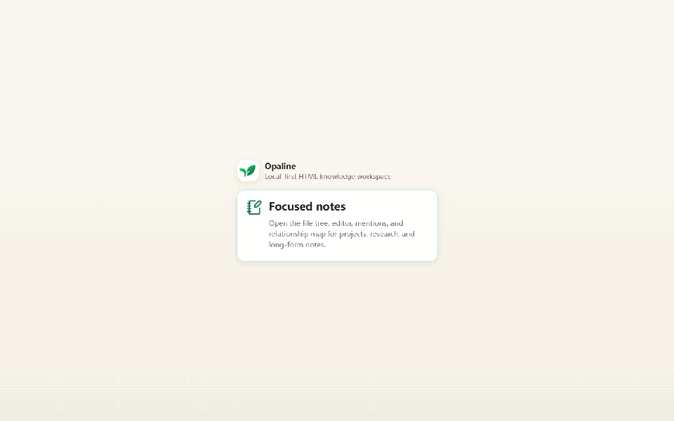

# Opaline

**中文说明：**[README.zh.md](README.zh.md)

Opaline is a local-first desktop knowledge workspace that stores notes as clean HTML files.

The goal is simple: your notes should remain useful outside the app. Each note is a normal local HTML document that can be opened in a browser, indexed by the app, linked to other notes, and eventually published or queried with AI using clear sources.

## Preview



- [Watch the short demo video](docs/media/opaline-demo.webm)
- Screenshots: [home](docs/media/opaline-01-home.png), [workspace](docs/media/opaline-02-workspace.png), [editor](docs/media/opaline-04-editor.png), [relationship map](docs/media/opaline-07-map.png), [settings](docs/media/opaline-08-settings.png)

## Status

Opaline is currently a **public alpha**.

- Windows is the primary active development target.
- macOS support is planned, but macOS builds should be produced and tested on macOS.
- Release builds are unsigned unless a release explicitly says otherwise.
- Back up your workspace before testing alpha builds with important notes.

## Why HTML Notes?

Markdown is excellent for plain text. Opaline explores a different bet: long-term knowledge work often needs richer structure.

Clean HTML can represent:

- headings, paragraphs, lists, tables, task lists, and code blocks
- images, attachments, callouts, embeds, math, and diagrams
- stable block IDs and deep links
- note links, heading links, block links, concept links, tags, and metadata
- documents that are already readable in a browser and close to publishable webpages

Opaline is not trying to save arbitrary browser/editor HTML. The project defines an Opaline HTML Profile so saved notes stay clean, predictable, portable, and friendly to search, links, publishing, and AI retrieval.

## What Works Today

The current alpha already includes:

- ✓ Tauri 2 + React + Tiptap desktop app
- ✓ automatic default workspace under the user's documents folder
- ✓ local HTML note creation, loading, editing, saving, and auto-saving
- ✓ file explorer with note actions
- ✓ rich editor blocks: headings, lists, tasks, tables, callouts, images, embeds, math, Mermaid, layouts, disclosures, and code
- ✓ lightweight document style system for body, headings, callouts, and code blocks, including font family, size, and color controls
- ✓ unified editor command registry shared by toolbar actions, context menus, slash commands, the command palette, and future AI editing flows
- ✓ editor slash command menu for headings, lists, rich blocks, media, math, diagrams, layouts, and disclosure blocks
- ✓ editor command palette opened from the toolbar or with `Ctrl+Shift+P`
- ◐ AI editor tool protocol with command descriptors, JSON schema validation, permissions, preview metadata, confirmation gates, history-snapshot hooks, risk metadata, and rollback hooks
- ◐ SQLite-backed metadata, search direction, tags, headings, links from this note, mentions of this note, and broken-link detection
- ✓ Relationship map with file, heading, block, and concept-level relationships
- ✓ local note history snapshots
- ✓ AI settings for provider, base URL, model, API key, model test, and model fetching
- ◐ experimental live widgets and extension folder support
- ◐ manual update check and install flow; GitHub release endpoint and updater signing key still need real release configuration
- ✓ interface language support and workspace-local language packs

Legend: ✓ implemented, ◐ partially implemented or still rough, ○ planned.

The public alpha currently opens into the focused workspace. The earlier casual Today entry is hidden while the core note workspace is polished.

## Still Rough

- Workspace migration needs a complete user-facing flow.
- Some file operations and history controls need more polish.
- Creating concept-level links from selected text still needs a friendlier UI.
- Block-link target highlighting can still be unreliable in the desktop editor.
- The updater UI exists, but public update delivery is inactive until GitHub release assets, updater endpoint, and signing key are configured.
- Builds are not yet signed/notarized for broad public distribution.
- Static publishing is planned but not part of the first alpha.

## Install and Run from Source

Prerequisites:

- Node.js
- Rust
- Tauri prerequisites for your OS

Run in development:

```bash
npm install
npm run tauri:dev
```

Build a local package:

```bash
npm run tauri:build
```

More packaging notes: [docs/release.md](docs/release.md); GitHub updater setup: [docs/updater-github.md](docs/updater-github.md)

## Data and Privacy

Opaline is local-first. A typical workspace looks like:

```text
Opaline/
  notes/
  assets/
  .opaline/
```

- `notes/` contains durable HTML notes.
- `assets/` contains images and files.
- `.opaline/` contains metadata, settings, indexes, cache, and history snapshots.

Local editing does not require a cloud account. Network access can happen when users configure AI providers, fetch model lists, run extensions or scripts, or open external links.

Read more: [docs/data-and-privacy.md](docs/data-and-privacy.md)

## Documentation

- [Website subproject](site/README.md) for the Cloudflare Pages static site
- [Chinese README](README.zh.md)
- [Document portal](index.html)
- [HTML README](README.html)
- [HTML format](docs/html-format.html)
- [Storage and architecture](docs/storage-architecture.html)
- [Search, AI, and publishing](docs/search-ai-publish.html)
- [Link rules](docs/link-rules.html)
- [Roadmap](docs/roadmap.html) with implementation status icons
- [Build and release notes](docs/release.md)
- [GitHub updater setup](docs/updater-github.md)
- [Changelog](CHANGELOG.md)
- [Contributing](CONTRIBUTING.md)
- [Security](SECURITY.md)

## License

Copyright (c) 2026 Enjun Lu.

Opaline is licensed under the [PolyForm Noncommercial License 1.0.0](LICENSE).

Noncommercial use is permitted under the license terms. Commercial use requires a separate commercial license from the author.
